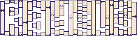
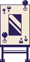

# Radèls

Radèls est une borne d'arcade cocktail1 dédiée2. Actuellement en cours de construction par Léon et Fabien.

Ce dépôt contient le code source du jeu et les informations concernant la construction de la borne.

<small>
1- Sous la forme d'une table avec l'écran à l'horizontale et les deux joueurs face-à-face. 
2- Qui ne se joue qu'avec un seul jeu.
</small>

## Installation

L'idée est d'installer retropie sur le raspberry et de faire demarrer le jeu directement avant emulationstation

### Configurer le raspberrypi

#### Installer et configurer RetroPie : 

(plus d'infos sur https://retropie.org.uk/docs/First-Installation/#installation)

1. Crééer une micro sd RetroPie pour rpi4
2. Démarrer le raspberry avec RetroPie
3. Configuerer les controles (clavier par exemple) 
4. Configuerer la langue du clavier si necessaire (menu RetroPie > raspi-config)
5. Configuerer le wifi (menu RetroPie > raspi-config)
6. Installer love (menu RetroPie > RetroPie Setup > Manage Packages > opt)
7. Installer love (menu RetroPie > RetroPie Setup > Manage Packages > opt)
8. Transferer le jeu via clé USB (cf. documentation de retropie)

### Configurer RetroPie pour démarrer directement sur le jeu

éditer `/opt/retropie/configs/all/autostart.sh` pour ajouter une ligne en tête :

    /opt/retropie/supplementary/runcommand/runcommand.sh 0 _SYS_ love ~/RetroPie/roms/love/radels.love

### Autre réglages

Il y a une bordure noire autour du jeu, il faut desactiver l'overscan (RetroPie > raspi-config) 

### Créer un .love à jour à partir de ce dépôt

Récupérer la version la plus récente du jeu

    # Cloner le dépôt
	$ git clone https://github.com/LeonLenclos/radels.git
	
	# Créér le fichier .love
	$ cd radels/src
	$ rm ../radels.love
	$ zip -r ../radels.love *

### Mettre le jeu sur la borne

D'abord créer une clé RetroPie :

1. Brancher une clé usb au rpi de la borne
2. Attendre un peu

Ensuite mettre [`radels.love`](radels.love) sur la clé, dans `/retropie/love/`. Enfin transferez le jeu :

1. Brancher la clé usb au rpi de la borne
2. Attendre un peu
3. Rebooter

## Règles

Se déplacer : Joystick
Tirer : A
Utiliser / Méditer : B

## Notes diverses

### Joysticks

    jstest /dev/input/js0
    jstest /dev/input/js1

### GPIO

librairie pour les gpio : https://github.com/Tieske/rpi-gpio/blob/master/lua/README.md

### Sorties du jeu
    
La sortie principale est un écran lcd où s'affiche le jeu. La borne possède aussi des leds pour transmettre des informations importantes au joueur et des enceintes pour la musique et les bruitages.

### Boutons

* Diametre trou grand bouton : 30mm
* Diametre trou petit bouton : 23.5mm

### L'écran

* Ref : Johnwill HD-133
* Résolution : 1920x1080
* Entrée Vidéo : Mini HDMI
* Taille de la dale : 13.3 inch (290mm x 170mm)
* Dimensions exterieurs : 328mm x 206mm x 12.5mm

### Leds

* output.p1_life_1
* output.p1_life_2
* output.p1_life_3
* output.p1_life_4
* output.p1_life_5
* output.p2_life_1
* output.p2_life_2
* output.p2_life_3
* output.p2_life_4
* output.p2_life_5
* output.p2_action_1
* output.p2_action_2
* output.p2_action_3
* output.p1_action_1
* output.p1_action_2
* output.p1_action_3

## Entrées du jeu

4 boutons-poussoirs :

* input.p1_shoot
* input.p1_action
* input.p2_shoot
* input.p2_action

2 joysticks :

* input.p1_up
* input.p1_down
* input.p1_left
* input.p1_right
* input.p2_up
* input.p2_down
* input.p2_left
* input.p2_right

1 monnayeur :

* input.insert_coin

