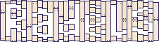

# Radèls

Radèls est un jeu de combat 1v1 en vue du dessus qui se joue sur une borne d'arcade cocktail dédiée.

Ce dépôt contient le code source du jeu et les informations concernant la construction de la borne.

Plus d'info sur http://leonlenclos.net/radels/

## Code

Le jeu est fait avec le fantastique framework [löve](https://love2d.org/), le code est un peu bordelique est faiblement documenté.

## Installation

L'idée est d'installer retropie sur le raspberry et de faire demarrer le jeu directement avant emulationstation

### Configurer le raspberrypi

#### Installer et configurer RetroPie :

(plus d'infos sur https://retropie.org.uk/docs/First-Installation/#installation)

1. Crééer une micro sd RetroPie pour rpi4
2. Démarrer le raspberry avec RetroPie
3. Configuerer les controles (clavier par exemple)
4. Configuerer la langue du clavier si necessaire (menu RetroPie > raspi-config)
5. Configuerer le wifi (menu RetroPie > raspi-config)
6. Installer love (menu RetroPie > RetroPie Setup > Manage Packages > opt)
7. Installer love (menu RetroPie > RetroPie Setup > Manage Packages > opt)
8. Transferer le jeu via clé USB (cf. documentation de retropie)

### Configurer RetroPie pour démarrer directement sur le jeu

éditer `/opt/retropie/configs/all/autostart.sh` pour ajouter une ligne en tête :

    /opt/retropie/supplementary/runcommand/runcommand.sh 0 _SYS_ love ~/RetroPie/roms/love/radels.love

### Autre réglages

Il y a une bordure noire autour du jeu, il faut desactiver l'overscan (RetroPie > raspi-config)

### Créer un .love à jour à partir de ce dépôt

Récupérer la version la plus récente du jeu

  # Cloner le dépôt
	$ git clone https://github.com/LeonLenclos/radels.git

	# Créér le fichier .love
	$ cd radels/src
	$ rm ../radels.love
	$ zip -r ../radels.love *

### Mettre le jeu sur la borne

#### Par ssh

1. Se brancher au rpi en ethernet
2. Allumer le rpi
3. Copier le jeu sur le rpi `scp radels.love pi@169.254.102.191:/home/pi/RetroPie/roms/love` (mot de passe = raspberry)

#### Par clé usb

**attention cette méthode ne semble plus marcher, préferer transfert par ssh**

D'abord créer une clé RetroPie :

1. Brancher une clé usb au rpi de la borne
2. Attendre un peu

Ensuite mettre [`radels.love`](radels.love) sur la clé, dans `/retropie/love/`. Enfin transferez le jeu :

1. Brancher la clé usb au rpi de la borne
2. Attendre un peu
3. Rebooter

## Notes diverses

### Joysticks

    jstest /dev/input/js0
    jstest /dev/input/js1

### GPIO

librairie pour les gpio : https://github.com/Tieske/rpi-gpio/blob/master/lua/README.md

### Sorties du jeu

La sortie principale est un écran lcd où s'affiche le jeu. La borne possède aussi enceintes pour la musique et les bruitages.

### Boutons

* Diametre trou grand bouton : 30mm
* Diametre trou petit bouton : 23.5mm

### L'écran

* Ref : Johnwill HD-133
* Résolution : 1920x1080
* Entrée Vidéo : Mini HDMI
* Taille de la dale : 13.3 inch (290mm x 170mm)
* Dimensions exterieurs : 328mm x 206mm x 12.5mm

### Entrées du jeu

4 boutons-poussoirs :

* input.p1_shoot
* input.p1_action
* input.p2_shoot
* input.p2_action

2 joysticks :

* input.p1_up
* input.p1_down
* input.p1_left
* input.p1_right
* input.p2_up
* input.p2_down
* input.p2_left
* input.p2_right
